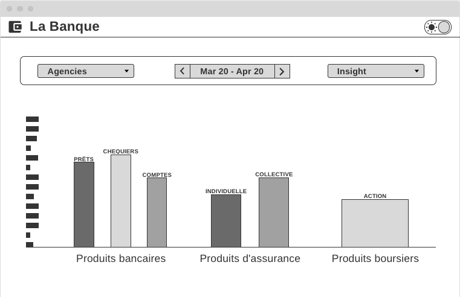
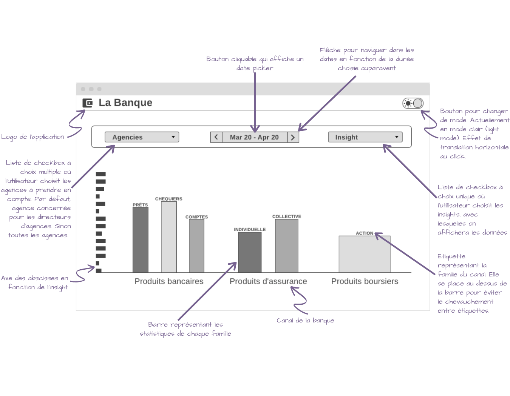
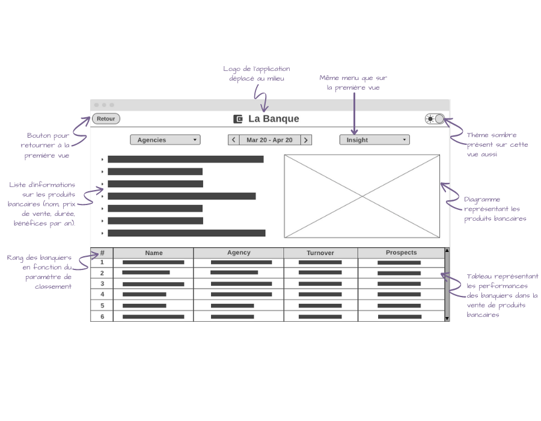

<h3>AISSAOUI Siham</h3>
<h1><b>RAPPORT DE PROJET</b></h1>

## I. Wireframes
### 1. Vue générale

Voici comment je choisis de représenter la vue globale de l'application :

La vue globale se compose de trois diagrammes représentants les statistiques de chaque canal. Les 3 diagrammes ne sont pas individuels, ils sont regroupés en un diagramme générale avec un seul axe abscisse et ordonnée, ce qui permet de mieux comparer les données dans les différents canaux. Les canaux sont distingués par leurs noms qui se place en dessous du canal ainsi que d'un espace vide. Le nom du canal bancaire est un bouton cliquable qui permet de passer à la deuxième vue de l'application. Lors du passage de la souris sur ce nom, la couleur du texte change pour que l'utilisateur comprenne que c'est un bouton. Au dessus des barres se trouvent des étiquettes correspondants à la famille que représente la barre. L'étiquette est mise au dessus de la barre pour éviter le chevauchement éventuel des étiquettes si elles étaient en dessous. Si deux barres adjacentes ont à peu près la même valeur, un espace entre les barres est prévu pour éviter la collision de deux étiquettes. Chaque diagramme contient autant de barre que de famille dans le canal. Lors du passage de la souris sur une barre, un pop up s'affiche avec la valeur de la barre dans le diagramme.

Un menu est à disposition pour modifier des paramêtres d'affichage :
* Une liste de checkbox à choix multiples contenant toutes les agences : L'agence sera préselectionnée en fonction de l'utilisateur. Si l'utilisateur est un directeur d'agence, alors la valeur par défaut sera sont agence. Si c'est le directeur de la banque, alors toutes les agences seront séléctionnées.
* Un date picker intelligent : date cliquable qui affiche un mini calendrier pour choisir une date de début et de fin. Lors de son choix, l'utilisateur peut ensuite avancer ou reculer de la même durée choisie sur le calendrier grâce aux flèches.
* Une liste de checkbox à choix unique permettant d'afficher les données des trois diagrammes en fonction d'un insight. Je choisis d'appliquer ce paramètre aux trois diagrammes en même temps pour des raisons pratiques.

Je choisis également de permettre à l'utilisateur de choisir entre deux modes visuels :
* Mode **clair** (light mode)
* Mode **sombre** (dark mode)

Voici le wireframe commenté avec tous les détails évoqués plus haut :

### 2. Vue du canal bancaire
La vue du canal bancaire se présente comme ceci :

Elle se décompose en trois éléments principaux :
* Une liste d'informations concernant le canal bancaire qui contiendrait des informations sur chaque produit (nom, prix de vente, durée, bénéfices par an...).
* Un diagramme représentant les valeurs du volume ou chiffre d'affaire de chaque produit.
* Un tableau des ventes de chaque banquier avec des informations pratiques comme le nom, l'agence à laquelle il appartient, le volume d'affaire/chiffre d'affaire, le nombre de prospects. On peut classer les banquiers en fonction des colonnes, ce qui permet de receuillir des informations utiles sur leur performance.

Les informations du diagramme et du tableau sont modifiables depuis le menu de paramètres en haut. On peut visualiser les ventes d'une seule ou plusieurs agences ou de toutes agences confondues en volumes ou en chiffre d'affaire et dans un certain laps de temps.

On conserve le même menu que pour la première vue, avec la possibilité d'activer ou désactiver le thème sombre. On rajoute un bouton de retour vers la vue précédente pour naviguer entre les vues.

Voici le wireframe commenté avec tous les détails évoqués plus haut :

