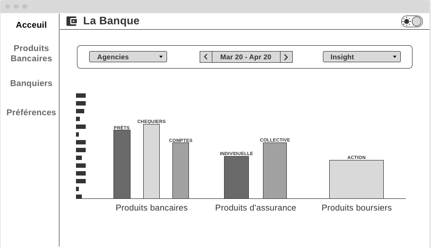
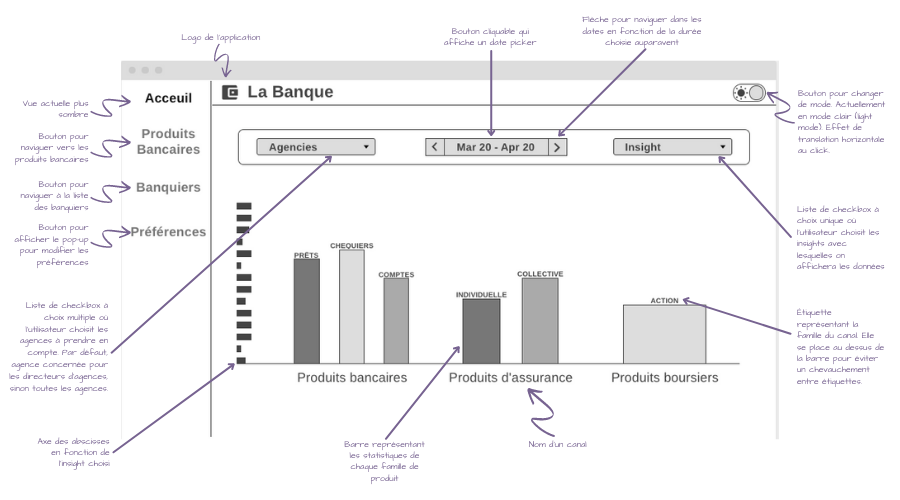
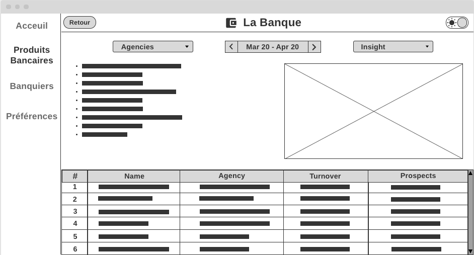
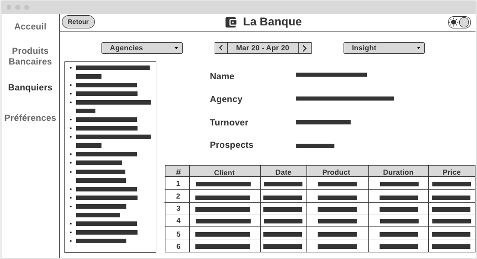
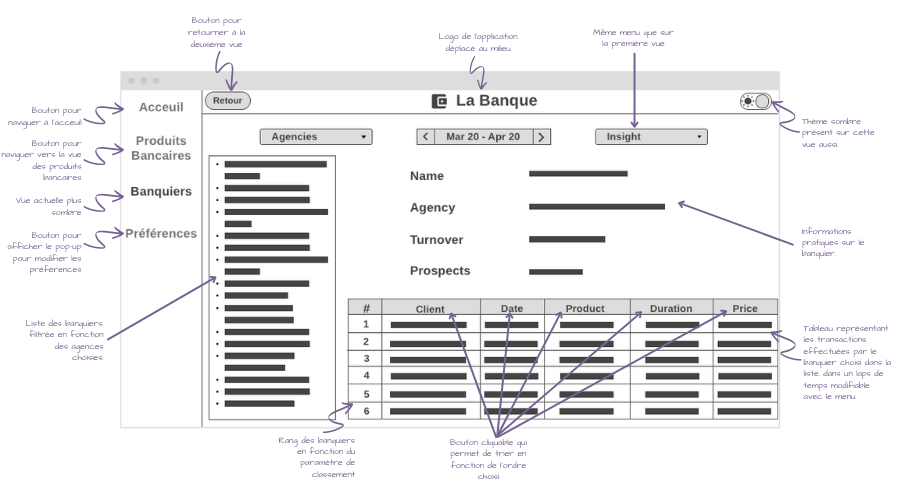
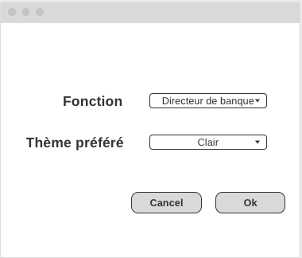
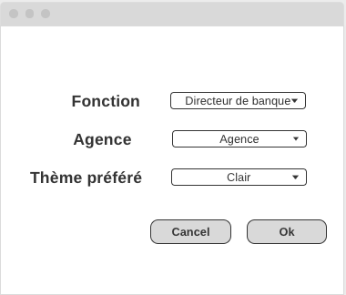

<h3>AISSAOUI Siham</h3>
<h1><b>RAPPORT DE PROJET</b></h1>

## I. Wireframes
### 1. Vue générale

Voici comment je choisis de représenter la vue globale de l'application :

La vue globale se compose de trois diagrammes représentants les statistiques de chaque canal. Les 3 diagrammes ne sont pas individuels, ils sont regroupés en un diagramme générale avec un seul axe abscisse et ordonnée, ce qui permet de mieux comparer les données dans les différents canaux. Les canaux sont distingués par leurs noms qui se place en dessous du canal ainsi que d'un espace vide. Le nom du canal bancaire est un bouton cliquable qui permet de passer à la deuxième vue de l'application. Lors du passage de la souris sur ce nom, la couleur du texte change pour que l'utilisateur comprenne que c'est un bouton. Au dessus des barres se trouvent des étiquettes correspondants à la famille que représente la barre. L'étiquette est mise au dessus de la barre pour éviter le chevauchement éventuel des étiquettes si elles étaient en dessous. Si deux barres adjacentes ont à peu près la même valeur, un espace entre les barres est prévu pour éviter la collision de deux étiquettes. Chaque diagramme contient autant de barre que de famille dans le canal. Lors du passage de la souris sur une barre, un pop up s'affiche avec la valeur de la barre dans le diagramme.

Un menu est à disposition pour modifier des paramêtres d'affichage :
* Une liste de checkbox à choix multiples contenant toutes les agences : L'agence sera préselectionnée en fonction de l'utilisateur. Si l'utilisateur est un directeur d'agence, alors la valeur par défaut sera sont agence. Si c'est le directeur de la banque, alors toutes les agences seront séléctionnées.
* Un date picker intelligent : date cliquable qui affiche un mini calendrier pour choisir une date de début et de fin. Lors de son choix, l'utilisateur peut ensuite avancer ou reculer de la même durée choisie sur le calendrier grâce aux flèches.
* Une liste de checkbox à choix unique permettant d'afficher les données des trois diagrammes en fonction d'un insight. Je choisis d'appliquer ce paramètre aux trois diagrammes en même temps pour des raisons pratiques.

Je choisis également de permettre à l'utilisateur de choisir entre deux modes visuels :
* Mode **clair** (light mode)
* Mode **sombre** (dark mode)
  
Et enfin, je mets à disposition un menu latérale pour naviguer entre les vues sans difficulté. Les boutons des vues inactives sont en gris. La vue active est plus sombre. Lors du passage de la souris sur un bouton inactif, il s'assombrit.

Voici le wireframe commenté avec tous les détails évoqués plus haut :

### 2. Vue du canal bancaire
La vue du canal bancaire se présente comme ceci :

Elle se décompose en trois éléments principaux :
* Une liste d'informations concernant le canal bancaire qui contiendrait des informations sur chaque produit (nom, prix de vente, durée, bénéfices par an...).
* Un diagramme représentant les valeurs du volume ou chiffre d'affaire de chaque produit.
* Un tableau des ventes de produits bancaires de chaque banquier avec des informations pratiques comme le nom, l'agence à laquelle il appartient, le volume d'affaire/chiffre d'affaire, le nombre de prospects. On peut classer les banquiers en fonction des colonnes, ce qui permet de receuillir des informations utiles sur leur performance. Lors d'un double clique sur une des rangées, on affiche la troisième vue avec les informations et la liste des transactions dans tous les canaux du banquier séléctionné.

Les informations du diagramme et du tableau sont modifiables depuis le menu de paramètres en haut. On peut visualiser les ventes d'une seule ou plusieurs agences ou de toutes agences confondues en volumes ou en chiffre d'affaire et dans un certain laps de temps.

On conserve les même menu que pour la première vue, avec la possibilité d'activer ou désactiver le thème sombre. On rajoute un bouton de retour vers la vue précédente pour retourner sur la vue précédente. On conserve aussi le menu latérale avec cette fois-ci comme bouton actif la vue actuelle.

Voici le wireframe commenté avec tous les détails évoqués plus haut :

### 3. Vue des banquiers

La troisième et dernière vue ressemble à ceci :

Cette vue contient tout d'abord une liste des banquiers de la banque qu'on peut filtrer en fonction des agences séléctionnées. Si l'on choisit une agence à laquelle appartient le banquier affiché actuellement, il reste séléctionné. Sinon, on séléctionne le premier banquier de l'agence choisie. Il suffit de cliquer sur un élément de la liste pour afficher les informations du banquier séléctionné et les transactions qu'il a effectué.

Ensuite on retrouve un bloc contenant les informations du banquier séléctionné (nom, agence d'affiliation, volume d'affaire, et nombre de prospects). L'information "Volume d'affaire" change en fonction de l'insight choisi.

Enfin, on peut visualiser toutes les transactions effectuées par le banquier dans un certain laps de temps avec la possibilité de classer les transactions en fonction des colonnes dans un ordre croissant ou décroissant.

On conserve les même menu que pour la première vue, avec la possibilité d'activer ou désactiver le thème sombre. On rajoute un bouton de retour vers la vue précédente pour retourner sur la vue précédente. On conserve aussi le menu latérale avec cette fois-ci comme bouton actif la vue actuelle.

Voici le wireframe commenté avec tous les détails évoqués plus haut :

### 4. Préférences

Lors du lancement de l'application, on affiche un pop up qui permet à l'utilisateur de paramétrer son application en fonction de ses préférences. Ce pop up ne s'affiche qu'une seule fois lors de la première utilisation.

L'utilisateur a deux préférences à paramétrer : 
* Sa fonction dans la banque : Quel position il/elle occupe. Si l'on choisit directeur de banque, le choix de l'agence n'apparait pas. Si l'on choisit directeur d'agence, un deuxième champ apparait sous la fonction : 
  

* Un thème préféré : Sombre ou clair. Lors du choix du thème, celui-ci s'applique sur le pop up afin de donner un aperçu du résultat à l'utilisateur.

On peut choisir de valider les préférences ou d'ignorer le paramétrage et passer directement à l'application grâce aux deux boutons Annuler/Valider.

Le paramétrage n'est pas définitif. Le bouton "Préférences" sur le menu latérale de l'application permet de réafficher ce pop up afin de modifier ses préférences.

## II. Liens
### 1. Lien du projet
* Projet [https://git.unistra.fr/saissaoui/bankstats](https://git.unistra.fr/saissaoui/bankstats)
### 2. Lien des wireframes
* Vue globale
[https://wireframe.cc/CkH8KL](https://wireframe.cc/CkH8KL)
* Vue Canal Bancaire
[https://wireframe.cc/z0DmS8](https://wireframe.cc/z0DmS8)
* Vue Banquiers
[https://wireframe.cc/ifA8pM](https://wireframe.cc/ifA8pM)
* Préférences
[https://wireframe.cc/BoVxlh](https://wireframe.cc/BoVxlh)

